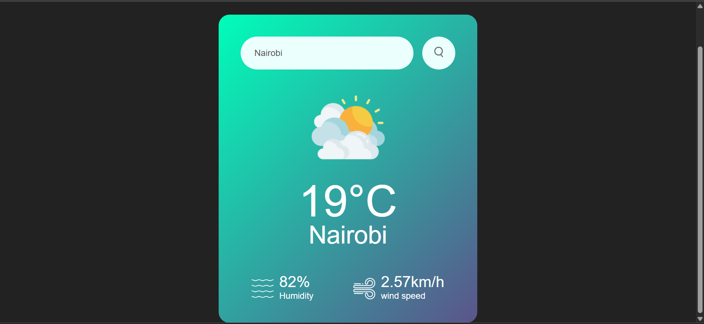
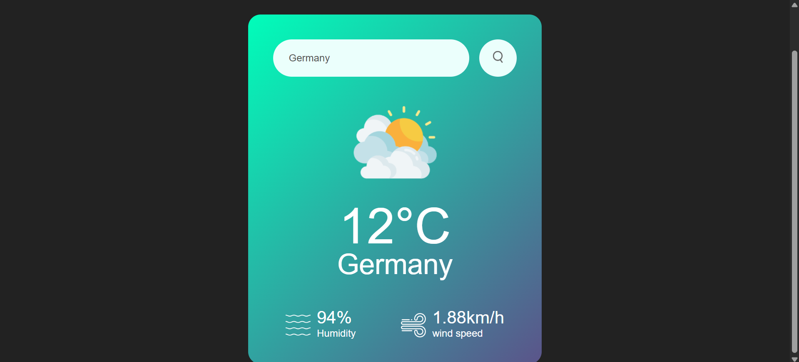

# 🌤️ Weather App

A simple and elegant **Weather App** that allows users to check real-time weather information for any city around the world.  
Built with **HTML**, **CSS**, and **JavaScript**, this app uses the **OpenWeatherMap API** to fetch and display live weather data.

## 🌍 Live Demo
👉 [Visit the weather app website](https://ephantus-weather-app.netlify.app/)

## 🚀 Features
- 🌎 Search weather by city name  
- 🌡️ Displays temperature, humidity, and wind speed  
- ☁️ Dynamic weather icons and background changes  
- 📱 Fully responsive design for all devices  
- ⚡ Real-time data fetched from OpenWeatherMap API

## 🧠 Technologies Used
- **HTML5** — Structure  
- **CSS3** — Styling and layout  
- **JavaScript (ES6)** — Functionality and API integration  
- **OpenWeatherMap API** — For live weather data  

## 📸 Screenshot

